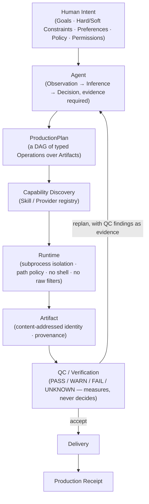

<div align="center">

# AI Video Production OS

**An open foundation for AI-native video production — not another AI video generator.**

[Architecture](#the-core-idea) · [Status](#current-status) · [Ecosystem](#the-ecosystem-today) · [Build a Skill](#skill-author-experience) · [Roadmap](#roadmap) · [Docs](docs/)

</div>

---

> **No badges here on purpose.** This repository has no CI, no package, and no license
> of its own yet — it is architecture and contracts, not a running system. See
> [Current status](#current-status) before assuming anything below is already built.
> The Skill repositories it describes are real, tested, and independently released —
> see [The ecosystem today](#the-ecosystem-today).

## What this is, in one sentence

A set of open contracts and shared execution infrastructure that let independent
Skills, Providers, and Agents — human or AI — turn video-production intent into
deterministic, verifiable, reproducible changes to a project's artifacts.

## Why it exists

Video production today is fragmented: editing, color, audio, subtitles, QC, and
delivery each live in different tools with no shared, inspectable record of what
happened or why. AI is entering this space mostly as **Prompt → Model → MP4** — a
closed box with no verification, no provenance, and no way to plug in a better
component later without rewriting everything around it.

This project starts from a different question, and answers it with evidence rather
than a pitch: eleven real, independently-built repositories
([`video-production-agent`](https://github.com/kajisho5/video-production-agent) plus
ten Skill repos) already do meaningful production work today. They were cloned and
audited directly — source, tests, CI, security code, commit history, not just READMEs
(full findings: [`docs/REPOSITORY_MAP.md`](docs/REPOSITORY_MAP.md)). That audit found
real, already-occurred problems a shared contract layer fixes and ad hoc patches would
not — for example, `qc-skill` and `media-analysis-skill` had independently
reimplemented the same loudness-measurement logic with no shared identity between them,
because nothing in the ecosystem could even *notice* it was duplication. This project
is the contract layer that makes facts like that visible and fixable, and lets Skills,
Providers, and Agents nobody has built yet join without anyone redesigning the core.

### This is not

- another AI video generator (Prompt → Model → MP4, no verification, no provenance);
- a Premiere / DaVinci Resolve / Final Cut replacement;
- an FFmpeg wrapper pretending to be an operating system;
- a single monolithic AI agent;
- a closed AI-video SaaS;
- a plugin marketplace (the foundation for one, deliberately not built yet);
- a collection of unrelated prompts.

Adjacent, real projects solve pieces of this space well — AI video generation tools,
agentic editing frameworks, pipeline orchestrators, media QC tools, skill registries.
[`docs/COMPETITIVE_ANALYSIS.md`](docs/COMPETITIVE_ANALYSIS.md) names them specifically
and says plainly where this project's focus differs (deeper verification/provenance
rigor and a contract-first, permissive-license interoperability story) rather than
claiming to be "first" or "the only one" at anything.

## The core idea



Only two pieces of this diagram are genuinely new, unimplemented ideas
(`ProductionPlan`-as-DAG and `Production Receipt`); the rest generalizes mechanisms
that already exist and run today inside `video-production-agent` and `qc-skill` — see
[`docs/CORE_PRIMITIVES.md`](docs/CORE_PRIMITIVES.md) for exactly which is which.

**The division of responsibility is the whole point:**

| | Owns | Never does |
|---|---|---|
| **Human** | Intent, creative direction, goals, constraints, approval | — |
| **Agent** (AI or human-driven) | Observation, reasoning, planning, capability selection, replanning | Execute a raw shell command or unvalidated filter string |
| **Skills / Runtime** (deterministic) | Execution, media processing, rendering | Make a production decision |
| **QC** (deterministic) | Measurement, verification | Decide what to do about a failure |

An Agent decides *what*; the Runtime controls *how*. This split is not aspirational —
it is already enforced, verified by grep across the entire real codebase: zero
occurrences of `shell=True` or a raw filter string accepted from a caller anywhere in
the eleven audited repositories.

## Why "OS"?

Not a literal comparison to Windows or macOS. "OS" here means the same thing it means
in "the OS for X" generally: the underlying coordination layer — contracts, discovery,
execution, artifacts, verification, provenance — that independent programs build on
without depending on each other's internals. The kernel is deliberately small: seven
components ([`docs/ARCHITECTURE.md`](docs/ARCHITECTURE.md) §8), none of which contain a
specific editing algorithm, a specific AI model, or a specific media engine.

## Current status

Never assume something below is shipped just because it's designed. Every document in
[`docs/`](docs/) tags every claim `CURRENT` / `FUTURE` / `EXPERIMENTAL` / `UNKNOWN`, and
this table follows the same rule:

| Area | Status |
|---|---|
| 11-repository audit, evidence base | **Implemented** — [`REPOSITORY_MAP.md`](docs/REPOSITORY_MAP.md) |
| Architecture, contracts, ~50 design docs, 10 ADRs | **Implemented** (as documentation — see [Documentation](#documentation)) |
| `video-production-agent` (Observation→Decision→Plan→Execution pipeline) | **Implemented, incomplete** — real, tested, no LLM wired in yet ([`NullProvider`](docs/REPOSITORY_MAP.md) only) |
| 10 Skill repos (editing, audio, color, subtitle, motion graphics, thumbnail, QC, analysis, transcription, ffmpeg execution) | **Implemented** — independently, each with real tests and CI |
| Capability Contract format, registry, conformance suite | **Planned** — [`docs/ROADMAP.md`](docs/ROADMAP.md) Phase 1 |
| Cross-ecosystem Provider collision resolution | **Planned** — Phase 3 |
| `ProductionReceipt`, edit-Timeline artifact | **Planned / designed, not built** |
| A second Agent, a second media-engine Provider, a real third-party Skill | **Vision, unverified** — architecturally designed for; nobody has built one yet. This is the single most important open question in the whole project — see [`docs/FINAL_REVIEW.md`](docs/FINAL_REVIEW.md). |
| Skill registry / marketplace, self-evolving OS | **Vision** — see [Built to evolve](#built-to-evolve) below |

Nothing here is described as "production-ready" or "complete," because it isn't, and
this project's own principles argue against saying so prematurely
([`docs/PRINCIPLES.md`](docs/PRINCIPLES.md)).

## The ecosystem today

Ten independent Skill repositories plus one orchestrating Agent — every one of them
cloned and verified directly, not taken on faith from a README:

| Repo | Role | Depends on |
|---|---|---|
| [`ffmpeg-skill`](https://github.com/kajisho5/ffmpeg-skill) | Typed FFmpeg execution — the shared media-execution substrate. **The only Skill published on npm today.** | — |
| [`video-editing-skill`](https://github.com/kajisho5/video-editing-skill) | Trim / cut / concat / resize | ffmpeg-skill |
| [`audio-production-skill`](https://github.com/kajisho5/audio-production-skill) | Gain / mix / normalize / dynamics | ffmpeg-skill |
| [`color-grading-skill`](https://github.com/kajisho5/color-grading-skill) | HDR→SDR / LUT / color tagging | ffmpeg-skill |
| [`subtitle-skill`](https://github.com/kajisho5/subtitle-skill) | Subtitle generation + burn-in | ffmpeg-skill (burn-in only) |
| [`motion-graphics-skill`](https://github.com/kajisho5/motion-graphics-skill) | Title cards / lower-thirds / overlays | ffmpeg-skill |
| [`thumbnail-skill`](https://github.com/kajisho5/thumbnail-skill) | Raster thumbnail composition | ffmpeg-skill (frame extraction only) |
| [`qc-skill`](https://github.com/kajisho5/qc-skill) | Deterministic QC — `PASS`/`WARN`/`FAIL`/`UNKNOWN`, never decides | ffmpeg/ffprobe directly |
| [`media-analysis-skill`](https://github.com/kajisho5/media-analysis-skill) | Deterministic observation, never mutates media | ffmpeg/ffprobe directly |
| [`transcription-skill`](https://github.com/kajisho5/transcription-skill) | Local ASR (faster-whisper), no cloud path | — |
| [`video-production-agent`](https://github.com/kajisho5/video-production-agent) | Orchestrator — Observation → Inference → Decision → Plan → IR → Execution. **Usable but incomplete: the first consumer of this OS, not the OS itself.** | all of the above |

`transcription-skill` is real, working, released — and was never part of this project's
original "9 Skills" framing. That is direct, load-bearing evidence: the Skill count was
never fixed, and this architecture is built specifically so it never has to be. Two
concrete gaps this audit found (a naming collision between two different meanings of
"Skill" inside `video-production-agent`'s own source, and the loudness-measurement
duplication mentioned above) are the reason `docs/CAPABILITY_MODEL.md` exists in the
shape it does — not invented problems, found ones.

Only current, verified repositories are listed above. Future Skills
(`voice-production-skill`, `dubbing-skill`, and others) are discussed as *examples of
what the architecture must support*, in [`docs/SKILL_EVOLUTION.md`](docs/SKILL_EVOLUTION.md)
and [`docs/DELIVERY_AND_INTEROP.md`](docs/DELIVERY_AND_INTEROP.md) — none of them exist
yet, and this README does not pretend otherwise.

## Quick start

**This repository is architecture and contracts, not an installable application** —
there is no `npm install ai-video-production-os`, because that package doesn't exist
and this README will not invent one. The real, working entry points today are the
individual Skill repositories. For example, `ffmpeg-skill` is genuinely published and
installable right now:

```bash
npm install -g ffmpeg-skill
ffmpeg-skill doctor      # check your environment's ffmpeg/ffprobe capabilities
ffmpeg-skill contract    # machine-readable capability declaration
```

(Skill packages are released independently of each other and of this repository —
`ffmpeg-skill`'s own npm and GitHub versions can briefly differ; see
[`docs/DISTRIBUTION_MODEL.md`](docs/DISTRIBUTION_MODEL.md) for what that actually looks
like today.)

The other nine Skills are Python packages (`pip install`-able from source per each
repo's own `pyproject.toml` — none are currently published to PyPI, marked `UNKNOWN`
rather than assumed). `video-production-agent` is the closest thing to a full
end-to-end entry point — see its own README for the current CLI. To understand the
architecture behind all of them, the path is:

```
This README → docs/ARCHITECTURE.md → docs/REPOSITORY_MAP.md → the repo you care about
```

## Skill author experience

A Skill in this ecosystem is not a prompt. It is a small, typed, independently-tested
package with a real security boundary:


If you're wondering "could I build a new production capability for this?" — start at
[`docs/SKILL_PROPOSAL.md`](docs/SKILL_PROPOSAL.md), which gives an ordered decision
procedure before you ever create a new repository: is this really just a new parameter
on an existing Capability? A new Capability inside an existing Skill? A new Provider of
a Capability that already exists (exactly the pattern `transcription-skill`'s own
engine registry already uses one level down)? Only if none of those fit do you propose
a new Skill — this ordering exists specifically to prevent the ecosystem from
sprawling into dozens of near-duplicate repositories.
[`docs/SKILL_SPEC.md`](docs/SKILL_SPEC.md) defines what makes a Skill conformant
regardless of implementation language — checked by structural, black-box tests, not by
an OS maintainer reading your source line by line
([ADR-009](docs/adr/ADR-009-plugin-conformance-over-code-review.md)).

## Built to evolve

AI in this architecture is not only meant to *use* Skills — the direction this project
is built toward is an ecosystem where AI can help find what the production system
itself is still missing:

```
Observe → Understand → Find gaps → Plan → Build / integrate → Verify → Learn ↺
```

**Today:** AI agents (currently `video-production-agent`, which has no real AI model
wired in yet — only a `NullProvider` stub — and runs its deterministic operations with
zero LLM involvement) can plan and orchestrate against the Skills that exist.

**Direction, not current behavior:** the architecture is deliberately shaped —
Capabilities as a discoverable registry rather than a hardcoded list, Skills as
conformance-checked rather than hand-reviewed, gaps like the qc-skill/media-analysis-skill
duplication as visible registry facts rather than silent bugs — so that an AI agent
could eventually help *identify* a missing Capability and *propose* a new Skill to fill
it, through the same [`docs/SKILL_PROPOSAL.md`](docs/SKILL_PROPOSAL.md) process a human
contributor would use, with any repository-creating or otherwise hard-to-reverse step
surfaced explicitly for a human to approve
([`docs/IMPLEMENTATION_PROTOCOL.md`](docs/IMPLEMENTATION_PROTOCOL.md) — never taken
silently, by an AI or otherwise).

This repository does not autonomously rewrite itself today. Nothing here claims it
does.

## Mission

Make professional and creative video production more interoperable, reproducible,
inspectable, and automatable — without making automation opaque or removing human
creative control. Concretely, that means: reducing fragmented, tool-specific
workflows; giving AI-assisted production an actual verification and provenance trail
instead of "trust the model"; and making new production capabilities addable to a
shared ecosystem without every contributor re-deriving the same security and contract
boundaries from scratch (which, per the audit, is exactly what happened independently
across seven-plus Skill repos before this project existed — see
[`docs/SECURITY_MODEL.md`](docs/SECURITY_MODEL.md)).

## Roadmap

| | |
|---|---|
| **Now** | Phase 0 (this research) is substantially complete. Phase 1: a reference Capability Contract format + registry library — requires zero changes to any existing Skill or Agent. |
| **Next** | Phase 2: retrofit existing Skills to publish the new contract (independently, repo by repo — the one phase that's genuinely parallelizable). Phase 3: resolve the qc-skill/media-analysis-skill Provider collision for real. |
| **Later** | Cross-Skill Artifact/Execution model, QC-verifies-Plan-conformance, `ProductionReceipt`. |
| **Vision** | Third-party Skill support with a published conformance harness; AI-assisted gap discovery (see [Built to evolve](#built-to-evolve)). Deliberately last — a plugin model designed before any real Skill has used it is guessing. |

Full phased plan with real dependencies between phases (not everything here can run in
parallel, and the roadmap says exactly which parts can't):
[`docs/ROADMAP.md`](docs/ROADMAP.md) · what changes / doesn't change for
`video-production-agent` specifically: [`docs/MIGRATION_STRATEGY.md`](docs/MIGRATION_STRATEGY.md).

## Contributing

Single-maintainer, pre-1.0, lightweight ADR-based decision process — see
[`docs/GOVERNANCE.md`](docs/GOVERNANCE.md). This project doesn't need users so much as
it needs the second Skill, the second Agent, or the second media-engine Provider that
would actually prove the independence claims above true in practice, not just in
design.

## Support

This project is, and will stay, open. Its creator ([@kajisho5](https://github.com/kajisho5))
also needs to be able to sustain building it — several Skill repositories already point
to [GitHub Sponsors](https://github.com/sponsors/kajisho5) for exactly this reason. No
other funding mechanism is claimed here beyond what's already configured in those
repos; nothing here should be read as a request layered on top of the architecture
itself. The intended order is mission first, then the ecosystem's value to users, then
whatever sustains the person building it — not the reverse.

## Documentation

The full architecture is documented across [`docs/`](docs/) (~50 files) and
[`docs/adr/`](docs/adr/) (10 decision records). Start with these five, in order:

1. [`REPOSITORY_MAP.md`](docs/REPOSITORY_MAP.md) — the evidence base
2. [`CORE_PRIMITIVES.md`](docs/CORE_PRIMITIVES.md) — what everything is
3. [`CAPABILITY_MODEL.md`](docs/CAPABILITY_MODEL.md) — Capability vs. Skill vs. Provider vs. Runtime
4. [`ARCHITECTURE.md`](docs/ARCHITECTURE.md) — the OS/Agent boundary, the kernel, the red-team pass
5. [`FINAL_REVIEW.md`](docs/FINAL_REVIEW.md) — the honest accounting of what's verified vs. assumed

Then: [`GLOSSARY.md`](docs/GLOSSARY.md) (every term, defined once) and
[`ARCHITECTURE_DECISIONS.md`](docs/ARCHITECTURE_DECISIONS.md) (a scannable ADOPT /
DEFER / REJECT table, if you want the conclusions before the reasoning).

## License

Not yet set for this repository (`UNKNOWN`). The individual Skill and Agent
repositories linked above carry their own licenses — check each one directly rather
than assuming they match.
