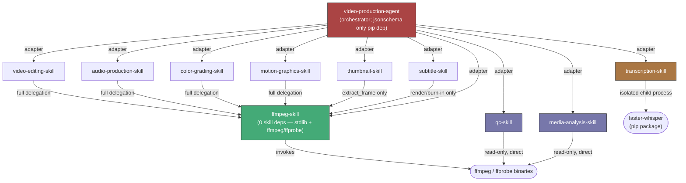

# Dependency Graph

Status: the first half of this document (§1–§3) is a **fact** — the real, current
repo-level dependency graph, built entirely from `REPOSITORY_MAP.md`'s evidence. The
second half (§4) is a **proposal** — the target Capability-id-level dependency graph per
`CAPABILITY_MODEL.md`, which does not exist yet anywhere in the ecosystem. The two are
kept in clearly separate sections so this document is never mistaken for describing one
graph that already exists.

## 1. Repo-level dependency graph (CURRENT, fact)

### 1.1 The base layer

`ffmpeg-skill` has **zero dependencies on any other Skill**. Its only dependencies are
the stdlib and the `ffmpeg`/`ffprobe` binaries it wraps (21 typed scripts, `argparse`
stdlib only, no third-party pip package — `REPOSITORY_MAP.md`). It is depended on by six
other Skills:

- `video-editing-skill` → ffmpeg-skill (full delegation — every operation)
- `audio-production-skill` → ffmpeg-skill (full delegation — every operation)
- `color-grading-skill` → ffmpeg-skill (full delegation — every operation)
- `motion-graphics-skill` → ffmpeg-skill (full delegation — every operation)
- `thumbnail-skill` → ffmpeg-skill (**partial** — only the `extract_frame` operation
  delegates; `render`'s Pillow-based raster compositing "never touches ffmpeg")
- `subtitle-skill` → ffmpeg-skill (**partial** — only the `render`/burn-in operation
  delegates; `generate` writes SRT/WebVTT directly, no ffmpeg call at all)

Each of these six relationships is implemented the same way, independently arrived at by
different authors (`REPOSITORY_MAP.md` finding 1, `ARCHITECTURE.md` §7): exactly **one**
designated module per repo (`ffmpeg_skill.py` / `adapter.py`) is the only place in the
codebase allowed to start a subprocess; it locates an `ffmpeg-skill` checkout (env var →
well-known paths), checks its `contract_version` against a supported range, and invokes
it as `[python, <ffmpeg-skill>/scripts/<tool>.py, <typed argv>, --json]`. Two of the six
(`video-editing-skill`, `audio-production-skill`) have a dedicated security test that
statically AST-walks every module in the repo to prove no other subprocess call exists
anywhere. Zero duplication of ffmpeg logic was found in any of the six.

### 1.2 The two direct-to-binary Skills

`qc-skill` and `media-analysis-skill` talk to the `ffmpeg`/`ffprobe` **binaries**
directly — **not** to the `ffmpeg-skill` package. This is a deliberate, verified
distinction, not an oversight: both are read-only observation/verification Skills with no
media-writing code path, and neither imports, subprocesses into, or version-checks
`ffmpeg-skill` at all. They sit at the same "talks to the binary" layer as `ffmpeg-skill`
itself, not one layer above it.

### 1.3 The dependency-free Skill

`transcription-skill` has no dependency on any other Skill in the ecosystem. It runs
`faster-whisper` (CTranslate2 Whisper) as an isolated child process it manages itself,
independent of both `ffmpeg-skill` and the ffmpeg/ffprobe-direct pattern. It is
cross-referenced by `subtitle-skill`'s README and by `video-production-agent`'s
integration CI, but neither of those is a *dependency of* `transcription-skill` — the
reference runs the other direction (things depend on it, or a plan composes its output
with theirs at the Agent level).

### 1.4 The orchestrator

`video-production-agent` depends on **all ten** Skill repos via its adapter layer
(`tools/<skill>/`, one adapter per Skill, one subprocess per call, JSON in/out). Discovery
is static and manual — `Service.adapter()` registers each by hand; there is, in the
codebase's own words, "no package loader, plugin manager or dynamic import"
(`skills/contract.py`). `jsonschema>=4.17` is its only pip dependency; it imports no
Skill's Python package directly.

### 1.5 Text summary of the graph

```
ffmpeg-skill                                   (0 skill deps; stdlib + ffmpeg/ffprobe binaries)
 ├─ video-editing-skill        (full delegation)
 ├─ audio-production-skill     (full delegation)
 ├─ color-grading-skill        (full delegation)
 ├─ motion-graphics-skill      (full delegation)
 ├─ thumbnail-skill            (partial: extract_frame only; render uses Pillow, no ffmpeg)
 └─ subtitle-skill             (partial: render/burn-in only; generate has no ffmpeg dep)

qc-skill                        → ffmpeg/ffprobe BINARIES directly (read-only; NOT the ffmpeg-skill package)
media-analysis-skill            → ffmpeg/ffprobe BINARIES directly (read-only; NOT the ffmpeg-skill package)
transcription-skill             → faster-whisper (pip dep; no skill-to-skill dependency at all)

video-production-agent          → ALL 10 of the above, via per-skill subprocess adapters
                                   (jsonschema>=4.17 is its only pip dependency)
```

### 1.6 Mermaid diagram — repo-level (CURRENT, fact)



## 2. Version-pinning pattern found — and the inconsistency it creates

The five fully-or-partially delegating Skills (`video-editing-skill`,
`audio-production-skill`, `color-grading-skill`, `motion-graphics-skill`,
`thumbnail-skill`) each check out `ffmpeg-skill` in their own CI **pinned to a specific
commit (`2abd89c`)** for testing, rather than tracking `ffmpeg-skill`'s default branch.
This is the disciplined pattern: a dependent Skill's CI is reproducible run-to-run because
the exact `ffmpeg-skill` state it tests against is fixed.

`video-production-agent`'s own integration CI does the opposite: it clones **all** sibling
Skill repos (all 10, `transcription-skill` included) at their **default branch HEAD**, not
at pinned commits. This is a real, present inconsistency, not a hypothetical one:

- The five delegating Skills' CI answers the question "does my code still work against
  the exact `ffmpeg-skill` I last validated against?" — reproducible, but can silently go
  stale if `ffmpeg-skill` moves on and nobody re-pins.
- `video-production-agent`'s integration CI answers a different question — "does the
  orchestrator still work against whatever every sibling Skill looks like *today*?" — which
  is exactly the shape of test most likely to pass or fail nondeterministically depending
  on unrelated changes landing in any of ten other repos on any given day, and the one
  most likely to mask a breaking change in a sibling Skill until it has already reached
  `main` there.

**Why this matters, concretely:** `video-production-agent` is the one consumer that talks
to *every* Skill in the ecosystem. If a sibling Skill's default branch introduces a
breaking `contract_version` bump the same day `video-production-agent`'s integration CI
runs, that CI run either fails for a reason unrelated to any change in
`video-production-agent`'s own repo, or — worse — silently exercises a subtly different
contract shape than the one someone last read and approved. The five-Skills-pinned-to-
ffmpeg-skill pattern does not have this failure mode; the orchestrator's HEAD-tracking
pattern does. This is flagged here as a real versioning risk this project's
`VERSIONING.md` must address (either by moving `video-production-agent`'s integration CI
to pinned-commit or pinned-tag checkouts of its siblings, matching the pattern the five
delegating Skills already validated, or by explicitly documenting why HEAD-tracking is an
intentional choice for an orchestrator that wants early warning of breaking changes — the
audit found no evidence either way of which was intended, only that the two patterns
disagree with each other today).

## 3. What this graph does NOT show (explicitly out of scope for §1)

- Pip/third-party dependencies (`Pillow>=10.0` for `thumbnail-skill`, `faster-whisper` for
  `transcription-skill`, `jsonschema>=4.17` for `video-production-agent`) are shown only
  as leaf nodes where directly relevant — they are not Skill-to-Skill edges.
- No repo in the ecosystem depends on a network service, database, or queue
  (`REPOSITORY_MAP.md` — explicitly confirmed absent everywhere). This graph is entirely
  local-process/subprocess edges.
- This is a **package/repo** dependency graph. It says nothing about *data* flow between
  Skills at Plan-execution time (e.g. `transcription-skill`'s output feeding
  `subtitle-skill`'s input) — that composition happens at the Agent/Plan level today
  (`REPOSITORY_MAP.md`'s subtitle-skill section is explicit that this is deliberate: "two
  skills that could have been coupled are kept independent, with the Agent... as the
  seam"), not as a repo dependency, and is out of scope for this document. See
  `SPEC.md` §3 (`ProductionPlan`) for the DAG that does model that.

## 4. Target graph: Capability-id dependencies (FUTURE, proposed)

Per `CORE_PRIMITIVES.md` §1 and `CAPABILITY_MODEL.md`, the graph in §1 is real but is the
**wrong level of abstraction for the OS to standardize on long-term**. A Skill declaring
"I depend on the package `ffmpeg-skill`, version range `>=0.9.1,<1.0.0`" is a *repository*
dependency. The target state is a Skill declaring "I need Capability `edit.cut` to exist,
satisfied by any conformant Provider" — a **Capability dependency**. This is not a new
mechanism invented from nothing; it is the same shape `transcription-skill`'s own internal
`engines/registry.py` already uses one level down (multiple ASR engines behind one
capability), lifted to the OS/Skill level.

### 4.1 Why this is the target, not the current state

- Today, if a second FFmpeg-alternative Skill (e.g. a hypothetical `gstreamer-skill`)
  wanted to provide `edit.cut`, every one of the five delegating Skills would need to be
  rewritten to know about it by name. Under a Capability-dependency model, they would
  declare a need for `edit.cut` and the registry would resolve it to whichever Provider
  is `AVAILABLE`/selected — no code change in the five dependent Skills.
- Today, `qc-skill` and `media-analysis-skill` cannot express "I am an alternate Provider
  of the same thing as X" at all, because there is no Capability id for either of them to
  register against — this is exactly why the §8a collision in `CAPABILITY_MATRIX.md`
  happened silently instead of being a visible registry fact.

### 4.2 Target-state Mermaid diagram (FUTURE, proposed — not implemented anywhere)

```mermaid
graph TD
    subgraph Capabilities["Capability registry (FUTURE)"]
        C_EDIT["edit.cut / edit.trim / edit.concat / ..."]
        C_AUDIO["audio.mix / audio.normalize / ..."]
        C_COLOR["color.hdr_to_sdr / ..."]
        C_SUB_GEN["subtitle.generate"]
        C_SUB_RENDER["subtitle.render"]
        C_MG["motion_graphics.title_card / ..."]
        C_THUMB["thumbnail.render / thumbnail.extract_frame"]
        C_TRANSCRIBE["transcribe.audio"]
        C_LOUD["measure.audio.loudness<br/>(2 Providers — collision, flagged)"]
        C_FREEZE["measure.video.freeze"]
        C_SCENE["measure.video.scene_detection"]
    end

    VE2["video-editing-skill"] -->|provides| C_EDIT
    AP2["audio-production-skill"] -->|provides| C_AUDIO
    CG2["color-grading-skill"] -->|provides| C_COLOR
    SUB2["subtitle-skill"] -->|provides| C_SUB_GEN
    SUB2 -->|provides| C_SUB_RENDER
    MG2["motion-graphics-skill"] -->|provides| C_MG
    TH2["thumbnail-skill"] -->|provides| C_THUMB
    TR2["transcription-skill"] -->|provides| C_TRANSCRIBE
    QC2["qc-skill"] -->|provides| C_LOUD
    QC2 -->|provides| C_FREEZE
    MA2["media-analysis-skill"] -->|provides| C_LOUD
    MA2 -->|provides| C_SCENE
    FFMPEG2["ffmpeg-skill"] -.->|provides base-layer capabilities<br/>consumed via Runtime, not repo import| C_EDIT

    VE2 -.->|needs capability, not package| C_EDIT
    AP2 -.->|needs capability| C_AUDIO
    CG2 -.->|needs capability| C_COLOR
    MG2 -.->|needs capability| C_MG
    TH2 -.->|needs capability| C_THUMB
    SUB2 -.->|needs capability| C_SUB_RENDER

    VPA2["video-production-agent<br/>(or any future Agent)"] -->|resolves via registry, not manual adapter list| Capabilities

    style C_LOUD fill:#a44,stroke:#333,color:#fff
```



**Reading note on the diagram:** the dotted "needs capability" edges from
`video-editing-skill` etc. back into `edit.cut`/`edit.concat`/etc. represent the same
underlying execution path as §1's solid `→ ffmpeg-skill` edges — the point of this
target graph is that the *declared* dependency changes shape (capability id, not package
name), not that the actual subprocess call to `ffmpeg-skill`'s tools disappears. The
Runtime (§`CORE_PRIMITIVES.md` §4) still executes the call the same way; only the
*discovery/declaration* layer moves from "I import/shell-out-to package X" to "I need
capability Y, resolved by the registry."

### 4.3 What does not change between §1 (current) and §4 (target)

- `ffmpeg-skill` remains the base execution layer. Nothing in the target model requires
  rewriting its 21 tools or its contract-generation mechanism.
- The single-designated-subprocess-module pattern (§1.1) remains the correct Runtime
  shape for *how* a Skill executes a delegated call — the target model changes how a Skill
  *finds* what to call, not how it calls it once found.
- `qc-skill` and `media-analysis-skill` remain direct-to-binary Skills; they gain a
  Capability id to register under, not a new dependency on `ffmpeg-skill`.

### 4.4 Roadmap pointer

Moving from §1 (fact) to §4 (target) is not a single flag-day migration — it is
`ROADMAP.md` Phases 1–3: Phase 1 defines the Capability Contract schema and a reference
registry; Phase 2 has each existing Skill additively publish that shape (their existing
`ffmpeg-skill` package dependency in `dependencies: [{skill_id, version_range}]` does not
need to disappear — a Skill can declare both a package dependency, for how the Runtime
actually invokes it, and the Capability ids it needs/provides, for how the registry
resolves discovery); Phase 3 is specifically the qc-skill/media-analysis-skill collision
becoming a registered, resolvable registry fact instead of the silent duplication shown
in §1. See `ROADMAP.md` for the full sequencing and why it cannot be done in one step.
