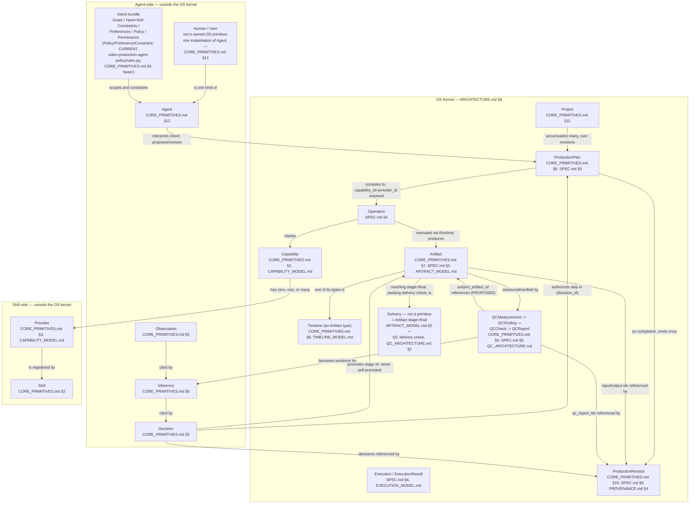
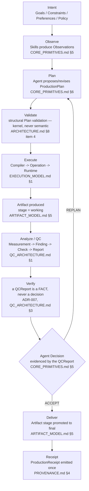
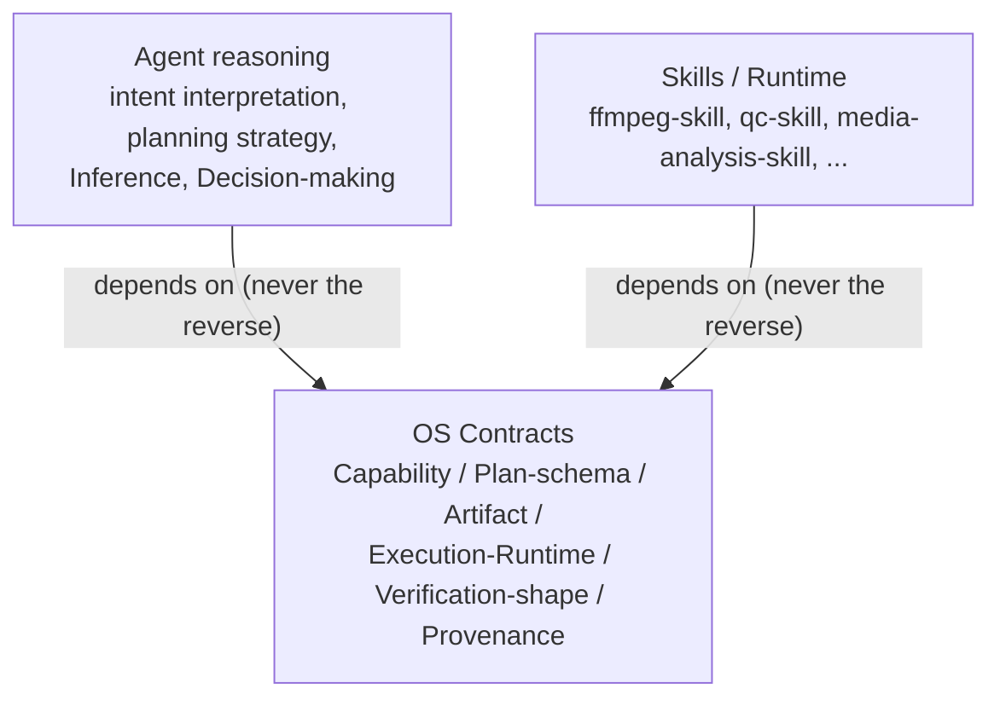

# Domain Model

Status tagging convention used throughout this document, per the rest of this project:
**CURRENT** (verified in code, per `REPOSITORY_MAP.md`), **FUTURE** (a direction described
in these docs but not implemented anywhere yet — this folds in what some source documents
label `PROPOSED`, since `REPOSITORY_MAP.md`'s own definition of `FUTURE` already covers
that shade of meaning), **EXPERIMENTAL** (exists but unstable/stubbed), **UNKNOWN** (could
not be verified, not fabricated). Every claim below is a synthesis of documents already
in `docs/` — `REPOSITORY_MAP.md`, `CORE_PRIMITIVES.md`, `CAPABILITY_MODEL.md`,
`ARCHITECTURE.md`, `SPEC.md`, `QC_ARCHITECTURE.md`, `EXECUTION_MODEL.md`,
`PROVENANCE.md`, `VERSIONING.md`, `SECURITY_MODEL.md`, `ARTIFACT_MODEL.md`,
`FAILURE_RECOVERY.md`, `GLOSSARY.md`, `PLUGIN_MODEL.md`, `SKILL_SPEC.md`, and
`COMPETITIVE_ANALYSIS.md`. This document does not redefine any primitive; where it
introduces a grouping or connective term not found verbatim in those documents (e.g.
"Intent bundle," "Delivery"), that is stated explicitly as this document's own synthesis,
not attributed to a source that doesn't contain it.

---

## Part (a): Layer doctrine evaluation

A stakeholder proposed 13 candidate layers for the OS. Each is evaluated against four
questions: is it **real** (evidenced by something that actually exists or is fully
specified), should it **merge** with another layer, should it **split**, is it **purely
conceptual** (a cross-cutting concern enforced elsewhere, not a layer with its own
primitives and machinery), and does it belong **in the OS kernel** (`ARCHITECTURE.md` §8)
or **outside** it (Agent logic, Skill logic, or process/tooling around the ecosystem).

### Summary table

| # | Candidate layer | Verdict | Kernel (§8)? |
|---|---|---|---|
| 1 | Intent | Real as data, not as a layer — merges into the Agent's input contract | Outside |
| 2 | Intelligence/Agent | Real — the Agent role. Merges with Intent and Planning-as-strategy into one "Agent" concern | Outside |
| 3 | Planning | Splits: Plan *schema + structural validation* → kernel item 4; Plan *strategy/judgment* → merges into Agent | Split (kernel + outside) |
| 4 | Capability | Real, distinct kernel layer | In kernel (item 2) |
| 5 | Skill | Real, distinct layer, but external to the kernel by design | Outside (plugin/ecosystem layer) |
| 6 | Execution/Runtime | Real, distinct kernel layer (already one concept, not two) | In kernel (item 5) |
| 7 | Media/Artifact | Real — but the layer is **Artifact**; "Media" is one Artifact type category, not a separate layer | In kernel (item 3) |
| 8 | Verification/QC | Splits: the *Report/Finding/Check/Measurement shape + PASS/WARN/FAIL/UNKNOWN semantics* → kernel item 7; the *check algorithms themselves* → Skill logic | Split (kernel + outside) |
| 9 | Provenance | Real, but a cross-cutting kernel concern that rides on Artifact/Operation/Plan/Decision rather than an independent pipeline stage | In kernel (item 6), cross-cutting |
| 10 | Security | Not a layer — a cross-cutting requirement enforced at the Runtime boundary | Cross-cutting (enforced in kernel item 5) |
| 11 | Resource | Not a layer — zero evidence of scheduling need; only a declared-hints field | Not a layer at all |
| 12 | Developer/Ecosystem | Splits: the *conformance-testing machinery* → folds into Execution/Runtime; everything else (proposal/governance/versioning process) is process, not a runtime layer | Split (kernel sliver + pure process, outside) |
| 13 | Human Interaction | Not a layer — one instantiation of the Agent role, plus the actor behind `Decision.approval` and Artifact stage-promotion | Cross-cutting, folds into Agent |

### 1. Intent

**Verdict: real as *data*, not real as a *layer*.** Nothing in the audited ecosystem
executes an "Intent" pipeline stage; there is no Intent service, no Intent object with its
own lifecycle distinct from what an Agent already consumes to reason. What is real and
**CURRENT**, not proposed, is that `video-production-agent`'s `policy/rules.py` already
implements `Policy`, `Preference`, and `Constraint` as distinct types feeding
`Decision.basis` (`CORE_PRIMITIVES.md` §5: "`basis` (policy/preference/constraint
provenance)"; `REPOSITORY_MAP.md`'s audit of `video-production-agent`). Goals, Hard
Constraints, and Soft Constraints are not separately named types anywhere in the audited
corpus — they are this document's own descriptive refinement of the same `Constraint`
concept (a constraint an Agent must satisfy vs. one it may trade off), not a new primitive
being invented. Permissions is genuinely ambiguous in this corpus and worth naming as such:
`PLUGIN_MODEL.md` §4 already uses "Permission" for a *Skill-facing* declaration (which
filesystem roots and network access a Skill needs) — a completely different scope from an
*Agent-facing* "what may I do without asking" permission, which is already covered by
`Decision.approval`'s `AUTO/CONFIRM/BLOCK` states (`CORE_PRIMITIVES.md` §5). This is a
second real naming collision worth flagging in the style of the Skill/Capability and
Timeline/Event-Timeline collisions `GLOSSARY.md` already documents — future work should
use "Permission (Skill)" and "Permission (Decision approval)" rather than one bare term.
**Conclusion:** Intent does not deserve independent-layer status. It is a bundle of
existing and closely-adjacent data (`Policy`, `Preference`, `Constraint`, `Decision.basis`,
`Decision.approval`) that the Agent layer consumes — it merges into the Agent concern, per
the task's own framing, matching `ARCHITECTURE.md` §3's placement of "interpret intent"
as something the Agent does, not a distinct OS layer.

### 2. Intelligence/Agent

**Verdict: real, but explicitly *not* an OS primitive** — `CORE_PRIMITIVES.md` §12 states
this precisely: "Not an OS primitive — a role, played by software the OS does not own."
`video-production-agent` is **a** Agent, not **the** Agent (`ARCHITECTURE.md` §1, §3).
Merges with Intent (§1 above) and with Planning-as-strategy (§3 below) into one conceptual
layer: the thing that interprets intent, reasons, proposes/approves Decisions and Plans,
and orchestrates Capability invocations (`ARCHITECTURE.md` §3's "What the Agent may do"
list). This layer sits entirely outside the kernel by design — `ARCHITECTURE.md` §8
explicitly excludes "any specific AI model or vendor SDK," confirmed already true today
(`NullProvider` is the only shipped `AIProvider`, `providers/base.py`).

### 3. Planning

**Verdict: splits cleanly along the kernel boundary already drawn in `ARCHITECTURE.md`
§8 item 4.** The `ProductionPlan` *schema* and its *structural* validation ("does every
referenced Capability/Artifact exist, are types compatible, is the DAG acyclic") is
explicitly listed as kernel item 4. Deciding whether a Plan is a *good* plan — the
actual planning strategy, sequencing judgment, and revision logic — is Agent judgment,
explicitly excluded ("never *semantic* validity... which is Agent judgment,"
`ARCHITECTURE.md` §8 item 4). So "Planning" is not one layer: the DAG-of-Operations shape
(`CORE_PRIMITIVES.md` §6, `SPEC.md` §3) is kernel; the reasoning that produces one is
Agent, merging into §2 above.

### 4. Capability

**Verdict: real, distinct kernel layer.** `ARCHITECTURE.md` §8 item 2 lists "Capability
registry — discovery, Provider registration, collision surfacing" as kernel. This is the
one layer in the whole candidate list whose necessity is backed by a concrete, already-
occurred bug (the `qc-skill`/`media-analysis-skill` loudness/silence/integrity
duplication, `REPOSITORY_MAP.md` finding 2) — `CAPABILITY_MODEL.md`'s entire document is
the evidence base. No merge or split is warranted; it is exactly as granular as
`CORE_PRIMITIVES.md` §1 and `CAPABILITY_MODEL.md` already define it.

### 5. Skill

**Verdict: real, distinct layer, but explicitly outside the kernel.** `ARCHITECTURE.md`
§8's "Explicitly NOT in the kernel" list names "Editing, subtitle, color, or QC
algorithms. These are Skill business logic" directly. `CORE_PRIMITIVES.md` §2 defines
Skill precisely and independently of Capability (fixing the `SkillPackage`/`SkillSpec`
naming collision found in `video-production-agent`'s own source,
`REPOSITORY_MAP.md`). Skill does not merge with Capability (a Skill is *what ships the
code*; a Capability is *what can be accomplished* — `CAPABILITY_MODEL.md`'s whole table).
It does not merge with Provider either (a Skill can be a Provider of several Capabilities;
Provider is the registration, Skill is the package — `CORE_PRIMITIVES.md` §3).

### 6. Execution/Runtime

**Verdict: real, and correctly presented as one layer, not two — this is not a merge
this document performs, it is already how `CORE_PRIMITIVES.md` §4 defines it.** Runtime is
"the OS-defined contract for how any Capability invocation actually executes" and
Execution (`EXECUTION_MODEL.md`) is the compiler/executor machinery that enforces that
contract per Operation. `ARCHITECTURE.md` §8 item 5 lists them together: "Execution/
Runtime contract — the safe-invocation guarantees... and the Operation/Execution/
idempotency-key model." Distinct kernel layer, evidenced by the convergent five-primitive
security pattern independently reinvented across seven-plus repos (`SECURITY_MODEL.md`
§1) — the strongest evidence base in the whole audit for any single layer's necessity.

### 7. Media/Artifact

**Verdict: real, but the layer is Artifact, not "Media/Artifact."** `SPEC.md` §2's
`Artifact.type` enum spans `video | audio | image | subtitle_document | project_ir |
qc_report | analysis_result | thumbnail | production_receipt | timeline` — "media" (video/
audio/image) is three of ten current type values, not a parallel concept sitting beside
Artifact. Treating "Media" as its own layer would double the model for no reason:
`ARTIFACT_MODEL.md` already generalizes identity, lifecycle stage, `produced_by`, and
caching uniformly across every type, media and non-media alike. `ARCHITECTURE.md` §8
item 3 lists this correctly as one kernel item: "Artifact model." No split needed.

### 8. Verification/QC

**Verdict: splits, the same way Planning splits.** The `QCMeasurement → QCFinding →
QCCheck → QCReport` *shape*, the `PASS/WARN/FAIL/UNKNOWN` worst-wins semantics, and the
`UNKNOWN`-on-empty rule are kernel (`ARCHITECTURE.md` §8 item 7: "the *shape*, not any
specific check's implementation"). The actual checks — LUFS measurement, freeze-frame
detection, decode-integrity — are Skill business logic, explicitly excluded from the
kernel by the same §8 sentence, and live in `qc-skill`/`media-analysis-skill` as ordinary
Providers of Capabilities like `measure.audio.loudness` (`QC_ARCHITECTURE.md` §4.2). This
is not a hypothetical split — it is the exact distinction `QC_ARCHITECTURE.md` §4.2
already draws between the *measurement layer* (shared, overlapping, Provider-shaped) and
the *verification/judgment layer* (`qc-skill`'s exclusive contribution, not present in
`media-analysis-skill` at all).

### 9. Provenance

**Verdict: real, and correctly a kernel item (`ARCHITECTURE.md` §8 item 6), but it is a
cross-cutting concern within the kernel rather than a sequential pipeline stage of its
own.** Provenance data rides on other primitives rather than existing independently: it is
a field on `Artifact` (`SPEC.md` §2's `provenance` dict), a set of identifying fields on
`Operation`/`QCReport` (`SPEC.md` §4, §5), and a roll-up artifact, `ProductionReceipt`
(`SPEC.md` §6), that references Decisions, Artifacts, and QCReports rather than
introducing new facts of its own (`PROVENANCE.md` §4: "the roll-up; per-Artifact
`provenance` dicts are the detail it summarizes... not a replacement for them"). It earns
kernel status because it is required *identically* by every Agent and Skill for
reproducibility (`PROVENANCE.md` §2's field table), which is exactly `CORE_PRIMITIVES.md`
§0's test for kernel membership — but it should not be pictured as a discrete stage
between, say, Execution and QC; it is recorded *at* Artifact production, *at* Operation
compilation, and *at* Plan completion, not as a separate hop.

### 10. Security

**Verdict: not a distinct layer — a cross-cutting requirement enforced at the Runtime
boundary, exactly as the task's own framing anticipates.** `SECURITY_MODEL.md` §1's
evidence base is the load-bearing citation: five primitives (`FORBIDDEN_KEYS`, symlink-
resolved `PathPolicy`, `shell=False` list-argv, workspace-confined output, process-group
timeout) were *independently reinvented* in at least seven of the eleven audited repos —
not designed once and shared. `EXECUTION_MODEL.md` §4 states directly where enforcement
actually happens: "The Execution layer is where the Runtime contract... is actually
enforced, per Operation, per subprocess." There is no separate Security layer with its own
primitives or its own place in the pipeline; there is one enforcement point (the Runtime/
Execution boundary) plus one process discipline (the conformance test suite,
`SECURITY_MODEL.md` §2) that verifies any Skill — cooperating or not — actually honors it
at that same boundary. Promoting Security to a standalone layer would misrepresent where
the guarantee actually lives.

### 11. Resource

**Verdict: not a layer at all, in the strongest terms this document uses for any
candidate.** `ARCHITECTURE.md` §10 states this explicitly, and the task brief's own
worked example repeats it for a reason: "No CPU/GPU/concurrency scheduling exists in any
audited repo. The OS does not invent one." `CORE_PRIMITIVES.md` §11 confirms: "**FUTURE,
minimal.** No CPU/GPU/concurrency scheduling exists anywhere in the ecosystem today
(confirmed absent in every audit)." What survives is a single declared-hints field on a
Capability Contract (`requires_visual_verification`, `audio_only`, `video_required`,
already present in `ffmpeg-skill`'s `ToolSpec`) — metadata, not machinery, not a
scheduler, not a coordinator. `EXECUTION_MODEL.md` §0 independently reaches the same
conclusion for execution specifically: "no evidence anywhere in the ecosystem shows a
need for one." Resource does not merge into anything and does not split into anything —
it is retired as a candidate layer.

### 12. Developer/Ecosystem

**Verdict: splits, and mostly falls outside any runtime layer entirely.** The one piece
of this candidate with real kernel relevance is the black-box **conformance test suite**
(`SKILL_SPEC.md` §8, `SECURITY_MODEL.md` §2, `ARCHITECTURE.md` §9 lens 3) — it exists to
verify, at the process boundary, that a Skill actually honors the Runtime contract, which
is why `ROADMAP.md` Phase 1 delivers it alongside the Capability Contract schema. That
sliver folds into Execution/Runtime (§6 above), not into a separate "Developer/Ecosystem"
layer. Everything else this candidate covers — `SKILL_PROPOSAL.md`'s granularity
criteria, `GOVERNANCE.md`'s ADR process, `VERSIONING.md`'s contract-version discipline,
`PLUGIN_MODEL.md`'s permission-declaration and compatibility-checking proposals — is
**process and documentation**, not a software layer with its own primitives, execution
order, or data shape. `GOVERNANCE.md` §0 states this candidly of itself: "a governance
document sized for a foundation or a multi-vendor standards body would be inventing
process for a scale this project has not reached." This candidate is real and useful, but
"conceptual" is the correct verdict for the majority of it — it is how humans and Skill
authors interact with the other twelve candidates, not a thirteenth thing running
alongside them.

### 13. Human Interaction

**Verdict: not a layer — folds entirely into the Agent role and into two existing
fields.** `CORE_PRIMITIVES.md` §12's own test names this directly: *"would this still
make sense... if `video-production-agent` were replaced by... a human using a CLI
directly?"* — a human is one concrete instantiation of the Agent role, not a separate
layer beside it (`GLOSSARY.md`'s Agent entry: "Agent — Not an OS primitive; a role played
by software (or a human)"). Concretely, human involvement enters the domain model at
exactly two places that already exist: `Decision.approval`'s `CONFIRM` state
(`CORE_PRIMITIVES.md` §5) and Artifact stage promotion, which is "an Agent- **or
human**-driven act" (`ARTIFACT_MODEL.md` §5). `ARCHITECTURE.md` §8's kernel exclusion
list confirms no UI is assumed or required ("A UI. None exists today; none is assumed"),
and §11's final test restates it: "Can a human operate the OS without an AI agent? Yes,
and this is intentional." No new layer, no split — Human Interaction is a cross-cutting
instantiation of Agent plus two field values already specified elsewhere.

### What this leaves: the actual layer count

Collapsing the 13 candidates per the verdicts above yields a much smaller, evidence-backed
picture: **one Agent-side concern** (Intelligence/Agent + Intent + Planning-strategy +
Human Interaction, all outside the kernel), **one Skill-side concern** (Skill + Provider,
also outside the kernel, publishing into the kernel's registry), **five kernel primitive
families** (Capability, Plan-schema/Execution-Runtime, Artifact, Verification-shape,
Provenance/Receipt — matching `ARCHITECTURE.md` §8's seven-item list once Plan-schema and
Execution/Runtime are read as the tightly coupled pair they already are), and **three
genuinely cross-cutting concerns that are never their own layer** (Security, enforced at
the Runtime boundary; Resource, reduced to a declared hint; Developer/Ecosystem process,
mostly outside the kernel entirely). This matches, rather than revises, the three-part
Agent/Core-OS/Skills shape `ARCHITECTURE.md` §3 already validates against evidence.

---

## Part (b): Canonical domain model

Every term below is diagrammed for its relationships only. Its authoritative definition
lives in exactly one of `CORE_PRIMITIVES.md`, `CAPABILITY_MODEL.md`, or `SPEC.md` (with a
second citation to a fuller treatment where one exists) — it is not redefined here.



### Reading the diagram

- **User/Human, Agent, Intent** sit outside the kernel entirely, matching Part (a)'s
  merge of Intent, Intelligence/Agent, Planning-strategy, and Human Interaction into one
  Agent-side concern. "Human/User" is not a named OS primitive anywhere in the audited
  corpus; it is modeled here as the concrete instantiation `CORE_PRIMITIVES.md` §12's own
  test requires ("a human using a CLI directly").
- **Observation → Inference → Decision** is unchanged from `CORE_PRIMITIVES.md` §5,
  adopted as-is; "Evidence" from the task's requested term list is not a fourth type — it
  is the *role* Observations and Inferences play as the mandatory `evidence` field on a
  Decision (`CORE_PRIMITIVES.md` §5: "mandatory `evidence`"). There is no separate
  `Evidence` primitive to point to.
- **Project → ProductionPlan** is a one-to-many, revision-accumulating relationship
  (`CORE_PRIMITIVES.md` §11: "a Project can accumulate multiple Plans over revisions").
- **ProductionPlan → Operation** happens at compile time, with `capability_id` and
  `provider_id` resolved *before* the Operation exists (`EXECUTION_MODEL.md` §1.1) — this
  is why Capability and Provider sit between Plan and Execution in the diagram rather than
  being consulted afterward.
- **Capability / Provider / Skill** form the three-layer split `CAPABILITY_MODEL.md`
  documents: "what can be accomplished," "which implementation does it," "what package
  ships the code," respectively.
- **Operation → Execution → Artifact** is `SPEC.md` §4's unchanged shape, generalizing
  `video-production-agent`'s `execution/compiler.py` → `execution/executor.py` chain.
- **Artifact → QC** is bidirectional in effect, not merely one-way: QC measures an
  Artifact, and — per the master flow in Part (c) — a `QCReport` becomes evidence feeding
  back into a new Inference/Decision, closing a loop rather than terminating a line.
- **Delivery** is not a primitive in any source document; it is this document's synthesis
  of two already-defined facts: an Artifact reaching `stage=final`
  (`ARTIFACT_MODEL.md` §5, "the delivered/exported version for a completed Plan") and
  passing the QC "delivery" check category, which is a *composition* of the other checks
  plus container/size/extension facts, not a fifth independent measurement domain
  (`QC_ARCHITECTURE.md` §2).
- **ProductionReceipt** is the roll-up, referencing Artifacts, Decisions, and QCReports
  by id rather than duplicating their content (`PROVENANCE.md` §4, `SPEC.md` §6) —
  emitted once per completed Plan, not a new stage of the pipeline in its own right.

---

## Part (c): Master state flow

### The loop, superseding the earlier linear draft



**This is a loop, not a line.** The earlier linear draft in `ARCHITECTURE.md` (and the
commonly-drawn `media-analysis → editing → audio → color → subtitle → graphics →
thumbnail → qc` sequence it explicitly warns against treating as mandatory,
`ARCHITECTURE.md` §6) terminates at verification. This flow does not: **REPLAN** is a
first-class edge back to **Plan**, not a dead end and not an error state.

### Refinement 1 — Production State is a query, not a new stored object

"Production State" is **not** a new primitive this document introduces as a stored
mega-object. It is a **view** computed on demand over primitives that already exist:

```
Production State (VIEW, never persisted as its own record) =
    Project                                     (CORE_PRIMITIVES.md §11)
  + latest ProductionPlan for that Project       (CORE_PRIMITIVES.md §6, §11)
  + Artifacts tagged with their current stage     (ARTIFACT_MODEL.md §5)
  + latest QCReport per relevant Artifact          (QC_ARCHITECTURE.md §1, SPEC.md §5)
  + the Decision log authorizing the Plan's steps   (CORE_PRIMITIVES.md §5, SPEC.md §3)
```

This is a deliberate rejection of a new abstraction, applying `ARCHITECTURE.md` §9's own
red-team discipline (lens 1, Simplicity: "kept, because... has one concrete job") in the
opposite direction — here the discipline says **don't** introduce something new. Three
pieces of direct evidence support treating "Production State" as a query rather than a
record:

1. `GLOSSARY.md`'s own **Production Context** entry already rejects a structurally similar
   idea: "**UNKNOWN** as a distinct, separately-specified primitive... The closest
   existing concepts are → Project... and → Workspace... if a distinct 'Production
   Context' primitive is introduced later, it should be defined relative to those two
   rather than assumed to be a third, overlapping concept." The same reasoning applies
   here without modification.
2. `ARTIFACT_MODEL.md` §3 makes the identical move for a related question (a
   Plan-execution "checkpoint"): "No audited repo emits a distinct 'Plan execution
   checkpoint' artifact type... This document does not propose adding one — the Job/
   idempotency-key record already serves this purpose and a second representation of the
   same fact would be exactly the kind of unjustified duplication `ARCHITECTURE.md` §9
   lens 1 argues against."
3. Every field the view needs already exists and is already queryable by id: `Project` and
   `ProductionPlan` (`CORE_PRIMITIVES.md` §11, §6), `Artifact.stage`
   (`ARTIFACT_MODEL.md` §5), `QCReport` per Artifact once `subject_artifact_id` lands
   (`QC_ARCHITECTURE.md` §5.1), and `Decision`s reachable via each Plan step's
   `decision_id` (`SPEC.md` §3). Storing a duplicate of all of this in a new object would
   create exactly the identity-drift risk `ARTIFACT_MODEL.md` §1 warns against for
   Artifact content vs. provenance hashes — a second copy that can silently disagree with
   the primitives it was derived from.

**Conclusion:** "Production State" is a read pattern an Agent (or a future dashboard/UI —
explicitly outside the kernel, `ARCHITECTURE.md` §8) computes by joining existing kernel
records, never a new mutable primitive the kernel writes.

### Refinement 2 — Verification feeds a Replan loop, QC still never decides

The **VerifyN → DecideN** edge is where this flow's most important refinement over a
naive read of `QC_ARCHITECTURE.md` §3 lives, and it must be read precisely so as not to
violate ADR-007. Three things are true simultaneously:

- **QC never decides.** `QC_ARCHITECTURE.md` §3, restating `qc-skill`'s own ADR-001 and
  formalized OS-wide as `ADR-007`: "the Capability may produce Observations, Measurements,
  Findings, and Reports, but must contain zero decision, render, publish, or block logic."
  A `QCReport.overall_status = FAIL` is a fact, exactly as `PASS` is — neither
  self-triggers anything (`ARTIFACT_MODEL.md` §5: "a QC `PASS` does not self-promote an
  Artifact's stage, exactly as a `FAIL` does not self-trigger anything either").
- **The replan decision belongs to the Agent, evidenced exactly like any other Decision.**
  `FAILURE_RECOVERY.md` §3 states the precise mechanics this flow adopts: a `QCReport`
  "becomes evidence for an Inference and a Decision... If that Decision authorizes another
  attempt at producing an acceptable Artifact... the result is a **new**
  `ProductionStep`/`Operation` with **different effective parameters**, and therefore a
  **different `idempotency_key`**... This is Plan-level replanning, authorized by a
  human- or Agent-made Decision with its own recorded evidence and basis — never an
  Execution-level retry of the same Operation."
- **Replan is mechanically distinguishable from retry.** The same section gives the exact
  test: "did the `idempotency_key` change? If yes, it is a new Operation authorized by a
  new Decision. If no, it would be an automatic retry of an Operation that already
  succeeded and reported a verdict — which... must never happen." This is why the
  **REPLAN** edge in the diagram above returns to **Plan**, not to **Execute** — a
  QC-driven course correction always produces a new Plan step, never a silent re-run of
  the one that already ran and reported.

**Conclusion:** the flow above is exactly `intent → observe → plan → validate → execute →
artifact → analyze/QC → verify → [accept → deliver → receipt] or [replan → back to plan]`
as specified, and the loop closes through the Decision type, not around it — QC's role is
unchanged from every other document in this set; only the *destination* of an Agent
Decision made in response to a QC finding (accept vs. replan) is new to this document.

### Dependency direction rule

High-level Agent reasoning **depends on** stable OS contracts (Capability, Plan-schema,
Artifact, Execution/Runtime, Verification-shape, Provenance/Receipt — Part (a)'s five
kernel families). Low-level Skills and the Runtime **never depend on** Agent reasoning.
No circular dependency is permitted between these two sides, in either direction:



This is not a proposed rule; it is **already true today, verified in the audited
ecosystem, not merely aspired to**. The single clearest piece of evidence is
`ffmpeg-skill`'s own manifest, cited throughout this document set: its `not_provided`
field explicitly lists `["AI reasoning", "decisions", "production plans", "project IR",
"approvals", "network access", "transcription engine"]` (`REPOSITORY_MAP.md`,
`SPEC.md` §1). A Skill sitting at the very bottom of the dependency graph — the one every
other Skill delegates ffmpeg execution to — self-declares, as a machine-readable contract
field, that it does not and will not import AI reasoning, Decisions, or Production Plans
into its own scope. `ARCHITECTURE.md` §3 states the rule this evidence backs directly:
"The OS never imports or depends on Agent logic. An Agent... always imports/depends on the
OS contract, never the reverse." This document extends that same rule one level further
down, to Skills specifically, using `ffmpeg-skill`'s self-declaration as the concrete
proof that the discipline already holds at the lowest layer of the stack, not only at the
OS/Agent seam `ARCHITECTURE.md` §3 was originally written about.
