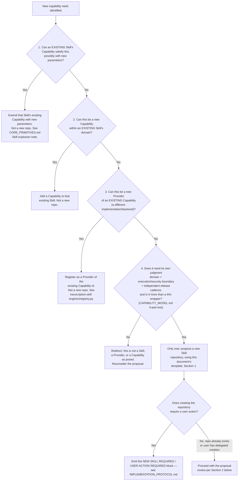

# Skill Proposal Process

Status tags as elsewhere: **CURRENT**, **PROPOSED**, **FUTURE**, **UNKNOWN**. This
document is entirely **PROPOSED** — no proposal process exists anywhere in the audited
ecosystem today (every Skill repo simply appeared as a single squashed commit;
`REPOSITORY_MAP.md` found no ADR, RFC, or review-request template governing how a new
Skill repo gets created). It is written as a practical checklist a contributor fills out,
not as philosophy, and it is built to reject two specific failure modes named in
`CAPABILITY_MODEL.md` §Avoiding both failure modes: **Skill explosion** (proposing a
Skill that is really just a thin wrapper, a Provider, or an Operation) and **monolithic
skill** (proposing to fold unrelated domains into one package because that seems
convenient).

This process governs how a Skill becomes **OS-compatible** — i.e., discoverable and
usable by any Agent through the Capability registry. It does not govern code quality,
bundling, licensing, or distribution, which are the Skill author's own concern (see §7).

## 1. The template

A proposal answers every question below. Skip a section only if it's genuinely not
applicable, and say so explicitly rather than leaving it blank.

### 1.1 Problem

What concrete production need is unmet by every existing Skill and Capability today?
Cite the specific gap — "there is no Capability that does X" — not a preference for a
different implementation of something that already exists (that's a Provider, §1.2).

### 1.2 Capabilities provided

List each Capability id the Skill would provide (`domain.action` shape, e.g.
`voice.dub`, matching the dotted namespace already used by `edit.trim`,
`measure.audio.loudness`, etc. — `CORE_PRIMITIVES.md` §1). For each one, check it against
`CAPABILITY_MODEL.md`'s granularity criteria **before** treating this as a Skill
proposal at all:

- **Is this actually a Capability at all**, or a Provider of one that already exists?
  If a Capability with this id (or an equivalent one) is already registered, this
  proposal is a **Provider proposal**, not a Skill proposal — it still needs a
  CapabilityContract and conformance testing (§4), but does not need a new Skill
  identity, and should be evaluated against the existing Capability's collision policy
  (`CAPABILITY_MODEL.md` §Capability collision policy) rather than as new ecosystem
  surface area.
- **Is this actually an Operation** — a parameter variant of a Capability an existing
  Skill already exposes (e.g. "silence-based trim" is an Operation of an
  `edit.trim`-adjacent Capability, not a new Capability) — rather than a genuinely new
  accomplishable thing? If so, this is a pull request against an existing Skill, not a
  new Skill proposal.
- **Does it pass all four "deserves a new Skill" criteria** (`CAPABILITY_MODEL.md`
  §Granularity)?
  1. A domain of judgment/parameters that doesn't reduce to typed operations another
     Skill already exposes.
  2. A security/execution boundary worth isolating on its own release cadence (its own
     external tool/binary/API, its own dependency and permission surface).
  3. Independently testable and versionable without forcing a release of an unrelated
     Skill.
  4. More than a thin wrapper — if most of the logic is "call another Skill with
     different default parameters," it fails this test.

  A proposal that fails any of these four should be redirected: to a new Operation on an
  existing Skill, a new Provider of an existing Capability, or — if it's cross-cutting
  infrastructure like path policy or process execution — a library contribution to the
  Runtime, not a Skill at all (`CAPABILITY_MODEL.md` §Granularity, "should be a
  library").

### 1.3 Inputs and outputs

For each Capability: input artifact type(s), output artifact type(s), drawn from the
`Artifact.type` enum in `SPEC.md` §2 (video, audio, image, subtitle_document,
project_ir, qc_report, analysis_result, thumbnail, production_receipt, timeline) or a
new type proposed alongside (rare — no Skill in the ecosystem has needed a new Artifact
type beyond this set yet).

### 1.4 Dependencies

- Does it need `ffmpeg-skill`? If so, at what `contract_version` range (see
  `VERSIONING.md`), following the pattern already used by 5 of the 10 existing Skills.
- Does it need a new external tool, binary, or API not already present anywhere in the
  ecosystem? Name it explicitly — this is exactly the kind of new dependency surface
  that justifies Skill-hood under criterion 2 in §1.2, but it also means this Skill
  becomes the ecosystem's only accountability point for that tool's security and
  licensing posture (see `COMPETITIVE_ANALYSIS.md`'s AGPL-3.0 caveat as an example of why
  this matters).
- Does it depend on another *Skill's* Capability, and if so, is that dependency modeled
  as a Skill-to-Skill runtime dependency (like the ffmpeg-skill pattern) or as a
  Plan-level composition (two Operations, one DAG edge — the pattern `subtitle-skill`
  and `transcription-skill` already use to stay decoupled, per `REPOSITORY_MAP.md`)?
  **Prefer Plan-level composition** unless the dependency is as foundational and stable
  as `ffmpeg-skill` is today — a direct Skill-to-Skill runtime dependency between two
  domain Skills is a coupling the Agent's planner should own instead, per
  `CORE_PRIMITIVES.md` §1's `subtitle.generate`/`transcribe.audio` example.

### 1.5 Permissions

- **Filesystem**: what workspace root(s) does it need read/write access to? State them
  explicitly — no existing Skill declares this formally today (they hardcode
  `PathPolicy` roots in source), so a new proposal should be the first to state this as
  a declared fact rather than an implementation detail (see `PLUGIN_MODEL.md`
  §Permission declaration).
- **Network**: does it need any network access at all? **No existing Skill in the
  ecosystem uses network access for anything** — confirmed absence across all 11 repos
  (`SPEC.md` §7: "no repo in the ecosystem talks to a network service today"). A
  proposal that requires network access (a cloud API, a remote model, a license-check
  callback) is not disqualified, but must receive **extra scrutiny**: it introduces a
  trust boundary (`SECURITY_MODEL.md`) nothing in the ecosystem has had to reason about
  yet, and its conformance review (§4) must explicitly cover what data leaves the
  workspace, to where, and under what credential — none of which the existing black-box
  conformance suite (`SKILL_SPEC.md` §8) currently checks, because nothing has needed it
  to.
- **External processes**: what binaries does it invoke, and via the single-designated-
  adapter-module pattern (`SKILL_SPEC.md` §5)?

### 1.6 Discovery

How does an Agent find out this Skill exists? **Answer is fixed, not a design choice for
the proposal to make**: by publishing a CapabilityContract (`SPEC.md` §1) that a
registry can read — no OS core code change, no edit to any hardcoded skill list. This is
the entire point of the Capability/Skill split (`CAPABILITY_MODEL.md`); a proposal that
requires editing OS core to become visible has failed the "new, unimagined Skill
tomorrow, no OS core changes" test in `ARCHITECTURE.md` §11 and should be reconsidered.
(Today's actual registry, `video-production-agent`'s `Service.adapter()`, does still
require a manual edit — this is a named, current limitation of the one existing Agent,
not a property this OS's contract requires; see `PLUGIN_MODEL.md` §Discovery.)

### 1.7 Agent integration

List the Capability ids from §1.2 exactly as they would appear to an Agent's planner. An
Agent selects Capabilities (and, when more than one Provider exists, a Provider) by id
when composing a `ProductionPlan` — a proposal does not need to say anything about *how*
any particular Agent's planning logic works (that's the Agent's business, per
`ARCHITECTURE.md` §3's OS/Agent boundary), only that the Capability ids are stable,
namespaced, and documented well enough that a planner (human or AI) can tell what they do
from the id, input/output types, and contract alone.

### 1.8 Testing

Must include, at minimum:

- The full black-box conformance suite from `SKILL_SPEC.md` §8 (contract publication,
  forbidden-key rejection, no unsafe shell-out, workspace confinement, no-clobber-input,
  lifecycle declaration, doctor reporting, ranged dependency versioning).
- The internal test floor from `SKILL_SPEC.md` §4 (security test, path-containment test,
  no-shell-execution test — AST-walk or language-equivalent where the Skill delegates
  execution, per §5 of that document — no-clobber-input test).
- Its own domain tests proving the declared Capabilities actually do what they claim.

A proposal that cannot describe what its domain tests would even check (because the
Capability itself is still too vague) is not ready for implementation yet, regardless of
how well it scores on §1.2's granularity criteria.

### 1.9 Path to OS-compatibility

**Contract validation, not code review of internals.** A Skill becomes OS-compatible
when:

1. Its CapabilityContract validates against `SPEC.md`'s shape.
2. It passes the black-box conformance suite (`SKILL_SPEC.md` §8) — a structural,
   automatable pass/fail, not a maintainer's subjective judgment of code quality, style,
   or implementation choices.
3. Its declared dependencies (§1.4) resolve to installed Skills within their declared
   `contract_version` ranges.

The OS does not require access to a Skill's source to certify it — this is a deliberate
consequence of the Runtime being process-boundary-shaped (`SKILL_SPEC.md` §7) and is
what makes third-party, closed-source, or non-Python Skills possible at all. This is not
a claim that code review has no value — a Skill author's own project may well require it
— only that OS-compatibility, specifically, is a contract-and-conformance fact, not an
OS-maintainer gatekeeping decision. See `PLUGIN_MODEL.md` §How the OS rejects an unsafe
plugin for the corresponding rejection-side mechanism.

## 1.10 Decision procedure: should this be a new Skill repository at all?

**PROPOSED — this section does not introduce new criteria.** `CAPABILITY_MODEL.md`
§Granularity already defines what deserves to be a new Skill, what should remain a
Capability, an Operation, a Provider, or a library. What that document does not do —
and what a contributor or an Agent filling out §1.2 above actually needs — is an
**ordered procedure**: a sequence of questions to ask, in order, that stops at the first
one that resolves the question, rather than a set of criteria to weigh all at once. This
section is that procedure. It restates nothing from `CAPABILITY_MODEL.md`'s criteria
themselves; it only orders them.

Walking the four steps in order:

1. **Can an existing Skill's Capability satisfy this, possibly with new parameters?** If
   the need is a parameter variant of something a Capability already does — the exact
   "Operation, not Capability" case §1.2 already names (e.g. "silence-based trim" vs.
   "explicit-range trim") — this is a pull request against an existing Skill's existing
   Capability. Stop here. No new repo, no new Capability id, no new Provider
   registration.
2. **Can this be a new Capability within an existing Skill's domain?** If the need is a
   genuinely new accomplishable thing, but it fits squarely inside a Skill that already
   owns that domain and already shares its execution substrate (the `ffmpeg-skill`
   "shared execution substrate" test from `CAPABILITY_MODEL.md` §Avoiding both failure
   modes), add it as a new Capability to that existing Skill. Stop here. No new repo.
3. **Can this be a new Provider of an existing Capability?** If a Capability with this id
   (or an equivalent one) is already registered, and what's actually being proposed is a
   different backend or implementation — not a different accomplishable thing — this is a
   Provider proposal, not a Skill proposal, exactly as §1.2 already states. This is the
   shape `transcription-skill`'s own `engines/registry.py` already uses one level down
   (multiple ASR engines behind one `transcribe.audio`-shaped internal interface), lifted
   to the OS level: a hypothetical cloud-ASR Provider of `transcribe.audio` alongside
   `transcription-skill`'s local `faster-whisper` Provider registers against the existing
   Capability id, per `CAPABILITY_MODEL.md`'s Provider examples — it does not need a new
   Skill identity. Stop here. No new repo.
4. **Only if steps 1–3 all answer "no"**: does this need its own judgment domain, its own
   execution/security boundary worth an independent release cadence, independent
   testability/versionability, and is it more than a thin wrapper around another Skill
   with different default parameters — `CAPABILITY_MODEL.md` §Granularity's full four-part
   "deserves a new Skill" test, all four parts, not a subset? If yes to all four, **this is
   the only point at which proposing a new Skill repository is warranted**, and the
   contributor proceeds to fill in this document's template (§1) in full.

**Why the ordering matters, not just the criteria.** `CAPABILITY_MODEL.md`'s own
§Avoiding both failure modes names **Skill explosion** — proposing what should be a thin
wrapper, a Provider, or a parameter variant as a brand-new Skill repository — as one of
the two failure modes this whole granularity model exists to prevent (the
`voice-production-skill`/`dubbing-skill`/`localization-skill` hypothetical is that
document's own worked example of exactly this trap). Weighing all of `CAPABILITY_MODEL.md`'s
criteria simultaneously, without an order, leaves room for a contributor to jump straight
to "does it pass the 4-part Skill test" and answer yes without first checking whether
steps 1–3 already resolve the need more cheaply. Forcing the check to happen **in this
order** — cheapest, least-committing resolution first — is what actually prevents the
sprawl `CAPABILITY_MODEL.md` names as a risk, rather than merely describing what sprawl
looks like after the fact.

**Where this connects to `IMPLEMENTATION_PROTOCOL.md`.** Reaching step 4 and concluding a
new Skill repository genuinely is needed is exactly the point at which creating that
repository becomes an externally-visible, hard-to-reverse action on the user's behalf —
and that action must never happen silently. See `IMPLEMENTATION_PROTOCOL.md` for the
`NEW SKILL REQUIRED / USER ACTION REQUIRED` reporting block: this document (`SKILL_PROPOSAL.md`)
still governs *what* the proposal must contain to be evaluated (§1's template, §2's review
checklist); `IMPLEMENTATION_PROTOCOL.md` governs *how* the need for a repository the agent
cannot create unilaterally gets surfaced to the user. The two are complementary, not
duplicative — this document does not restate that reporting mechanism, and
`IMPLEMENTATION_PROTOCOL.md` does not restate this document's granularity criteria.

## 2. Review checklist (for whoever evaluates a proposal)

A reviewer should be able to answer every one of these with evidence from the proposal
document itself, not by inferring intent:

- [ ] Problem is concrete and not already solved by an existing Capability.
- [ ] Every listed Capability passes all four granularity criteria (§1.2); none is
      redirected to a Provider or Operation proposal instead.
- [ ] Input/output artifact types are drawn from the existing `Artifact.type` enum or a
      new type is explicitly justified.
- [ ] Dependencies are named, with `contract_version` ranges where applicable, and
      Skill-to-Skill coupling is minimized in favor of Plan-level composition (§1.4).
- [ ] Filesystem permissions are stated explicitly.
- [ ] Network access, if requested, is flagged and justified with a data-flow answer
      (what leaves the workspace, to where, under what credential) — absence of network
      access is the ecosystem norm and should be the default assumption.
- [ ] Discovery requires no OS core change.
- [ ] Capability ids are planner-legible (stable, namespaced, documented).
- [ ] The testing plan names the full conformance suite plus domain tests.
- [ ] Nothing in the proposal asks an OS maintainer to review or approve the Skill's
      internal source as a precondition of compatibility.

A proposal failing any unchecked item is not rejected outright — it's returned with the
specific gap named, exactly like any other structural-not-subjective review this project
favors (`ARCHITECTURE.md` §9, red-team lens 3).

## 3. Worked example: `voice-production-skill` (illustrative only)

This walkthrough is **illustrative of how the template is filled in** — it is not a
commitment to build this Skill, and no such repo exists in the audited ecosystem today.

- **Problem**: no existing Skill or Capability handles voice-level production
  operations distinct from `audio-production-skill`'s generic gain/mix/normalize/
  dynamics set — specifically, dialogue-leveling judgment calls (per-speaker loudness
  matching across cuts) and de-essing, neither of which is a parameter variant of
  `audio-production-skill`'s typed `DYNAMICS`/`NORMALIZE` operations.
- **Capabilities**: `voice.deess`, `voice.level-match`. Checked against §1.2: (1) both
  require judgment (frequency-band and per-speaker threshold selection) that doesn't
  reduce to `audio-production-skill`'s existing typed operations; (2) both share one
  execution boundary (an ffmpeg-based spectral/dynamics chain) worth its own release
  cadence, independent of `audio-production-skill`'s; (3) independently testable without
  forcing an `audio-production-skill` release; (4) not a thin wrapper — the de-essing
  frequency selection and per-speaker matching logic is the actual product, not a
  relabeled `ffmpeg-skill` call. Passes all four; this is a genuine Skill candidate, not
  a Provider or Operation.
- **Explicit rejection this proposal must survive**: could `voice.deess` and
  `voice.level-match` instead be two new Operations added to `audio-production-skill`'s
  existing `DYNAMICS` Capability? This is the exact "Skill explosion" challenge
  `CAPABILITY_MODEL.md` names for a hypothetical `voice-production-skill`,
  `dubbing-skill`, `localization-skill` trio — if all of this delegates 100% of
  execution to `ffmpeg-skill` and differs from `audio-production-skill` only in default
  parameter sets, it should be two Capabilities added to `audio-production-skill`, not a
  new Skill. A real proposal would need to show *why* the judgment involved (speaker
  identity correlation, perceptual threshold tuning) is a separate domain of expertise
  from `audio-production-skill`'s existing gain-staging domain — this worked example
  asserts that case but does not prove it; a real proposal review would need to actually
  weigh it.
- **Inputs/outputs**: input `audio` (or `video` with embedded audio), output `audio`.
- **Dependencies**: `ffmpeg-skill` (afftdn/deesser-equivalent filter, dynamics chain),
  pinned to a supported `contract_version` range, same pattern as
  `audio-production-skill`. No dependency on `audio-production-skill` itself — if
  per-speaker matching needs speaker boundaries, that's an input `Artifact` (e.g. a
  `SpeechEvent`-derived speaker-segment list from `transcription-skill`) supplied by the
  Plan, not a Skill-to-Skill import — the same decoupling pattern `subtitle-skill`/
  `transcription-skill` already demonstrate.
- **Permissions**: filesystem — read access to the input audio/video workspace root,
  write access to a designated output workspace root, nothing else. Network — none
  needed; no scrutiny flag required.
- **Discovery**: publishes a CapabilityContract naming `voice.deess` and
  `voice.level-match`; no OS core change.
- **Agent integration**: an Agent's planner selects `voice.level-match` as a Plan step
  when dialogue continuity across cuts is a detected issue (an Inference, per
  `CORE_PRIMITIVES.md` §5) — how a planner decides that is the Agent's logic, out of
  scope for this proposal.
- **Testing**: full conformance suite (§1.8) plus domain tests asserting measurable
  loudness convergence across speaker segments and de-essing frequency-band attenuation
  within declared tolerances.
- **OS-compatibility path**: contract validation plus conformance suite pass, per §1.9 —
  no OS maintainer review of the actual de-essing algorithm's audio quality is required
  for compatibility (that's a quality question for the Skill's own users/maintainers,
  not an OS-compatibility gate).

## 4. What this document deliberately does not define

- Governance: who has authority to accept or reject a proposal, and by what process
  (consensus, maintainer fiat, voting) — no evidence exists in the audited ecosystem for
  any prior governance model, since every repo is single-owner (`kajisho5`) today
  (`REPOSITORY_MAP.md`). This is named as an open question for `ROADMAP.md`, not decided
  here.
- Code-quality, style, or licensing review — orthogonal to OS-compatibility (§1.9), and
  each Skill author's/maintaining organization's own concern.
- A marketplace, package index, or distribution channel — that's `PLUGIN_MODEL.md`'s
  explicit non-goal for this phase, and this document does not smuggle one in through the
  proposal process either.
